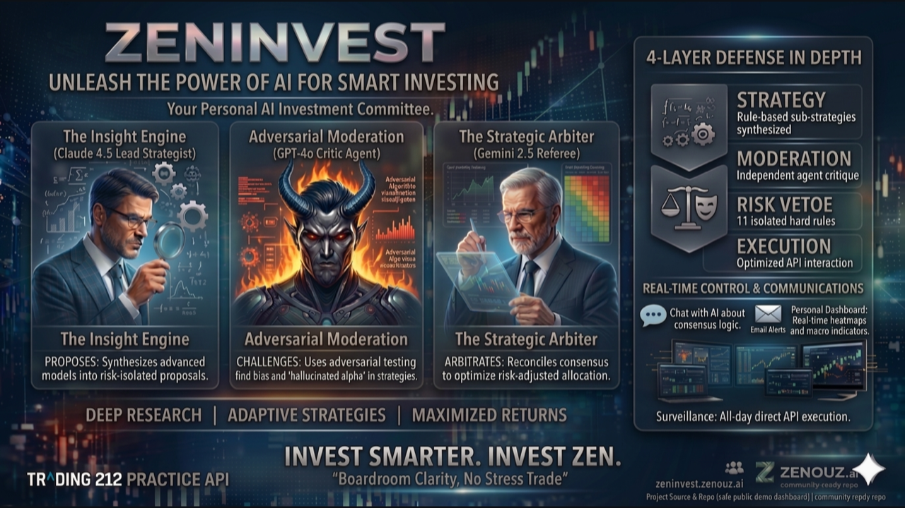
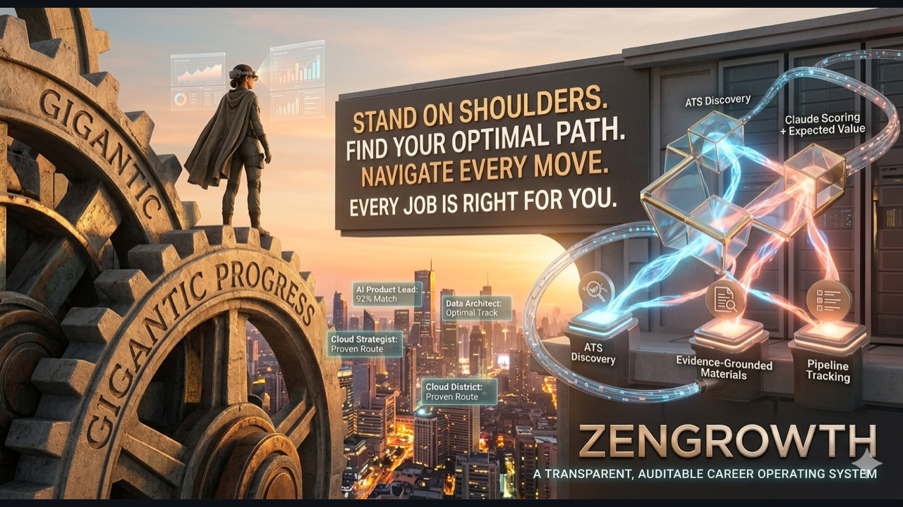
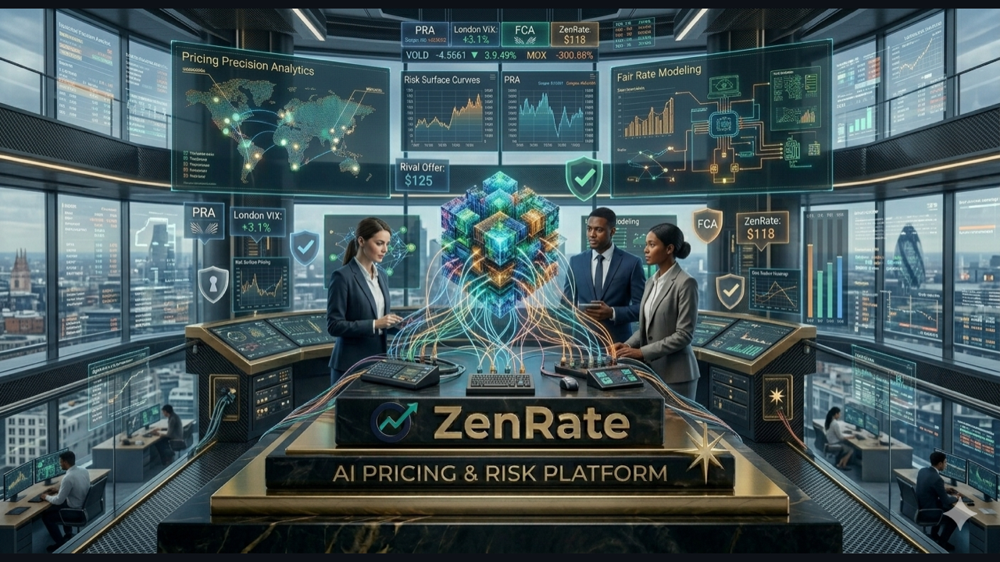
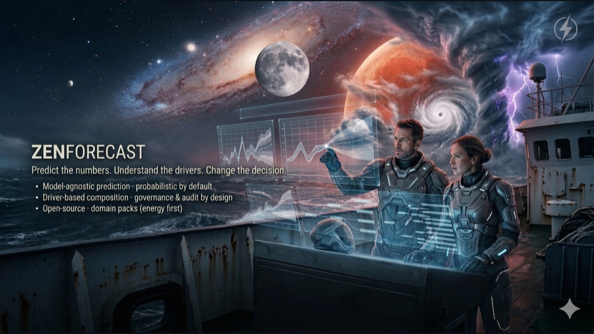
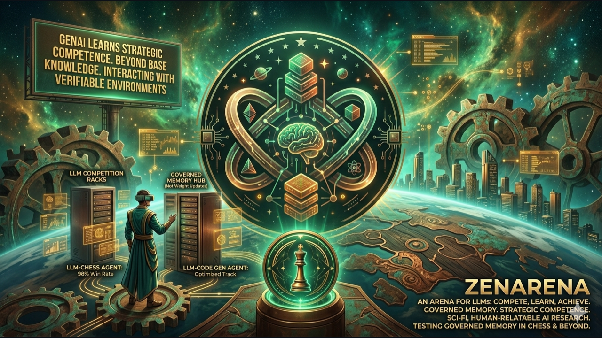
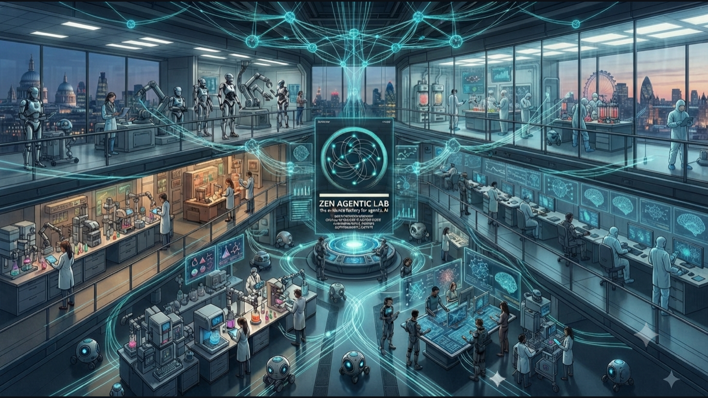
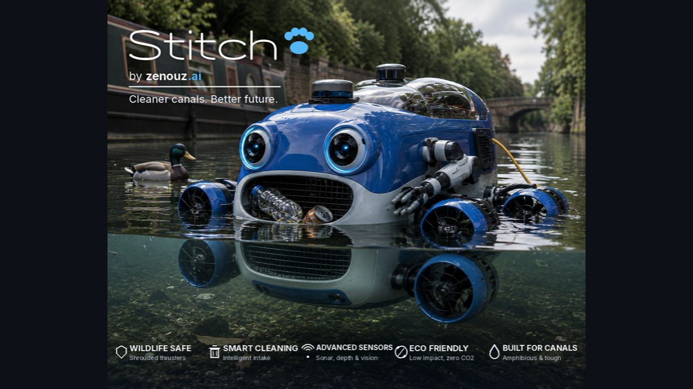

<h1 align="center">Hi 👋 I'm Kayvan</h1>

  

  
  
  

---

### 🧭 What I do

Technical AI lead specialising in **agentic AI** and **multi-LLM architectures** for high-stakes, regulated environments — systems where specialist agents reason while a **deterministic core makes the consequential decisions**, with evaluation, observability, and governance built in. A mathematician at the core, an educator by habit.

- 🔭 Currently leading & building **agentic AI projects for energy** at EY, with mandates extending into utilities and robotics
- 🧠 Designing multi-agent systems that stay **inspectable**, with hard safety rules sitting *above* model output
- 🎓 **PhD in Mathematics** (Exeter) · former university lecturer (400+ students/term)
- ✍️ Writing and building in public at **[zenouz.ai](https://zenouz.ai)** and **[github.com/zenouz-ai](https://github.com/zenouz-ai)**

### ⭐ Highlights

- 🏗️ Built and led a **10-person AI team** from scratch and delivered **£2.05M realised commercial value** in regulated financial services
- 🗣️ Trusted AI advisor to **Retail CEO / CFO / COO** · **Forum Innovation Award 2026** · speaker at **Dataiku Summit 2025**
- 🧪 7 public R&D projects exploring agentic AI, multi-LLM orchestration, governed memory, and simulation-first robotics

### 🚀 Public projects

Seven public builds where AI agents meet deterministic cores, evaluation gates, audit trails, and simulation-first engineering.

<table>
  <tr>
    <td width="50%" valign="top">
      
      <h3 align="center"><a href="https://github.com/zenouz-ai/zeninvest">ZenInvest</a></h3>
      
Autonomous, multi-LLM <strong>investment committee</strong> where Claude leads strategy, GPT-4o plays skeptic, and Gemini scores risk before any trade. Deterministic Python owns every safety-critical control.

      
<em>~62K LOC · 1,341 passing tests · Dockerized on a VPS.</em>

    </td>
    <td width="50%" valign="top">
      
      <h3 align="center"><a href="https://zenouz.ai/projects/zengrowth/">ZenGrowth</a></h3>
      
Evaluation-driven <strong>career operating system</strong> using RAG, GraphRAG, and LLM-as-judge to score senior roles and write evidence-grounded applications with traceable truth paths.

    </td>
  </tr>
  <tr>
    <td width="50%" valign="top">
      
      <h3 align="center"><a href="https://zenouz.ai/projects/zenrate/">ZenRate</a></h3>
      
Open-source, plugin-based <strong>pricing and risk engine</strong> wrapping a deterministic actuarial core in collaborating AI agents for regulated, auditable insurance workflows.

    </td>
    <td width="50%" valign="top">
      
      <h3 align="center"><a href="https://zenouz.ai/projects/zenforecast/">ZenForecast</a></h3>
      
Open-source <strong>agentic forecasting framework</strong> turning forecasting into a continuous predict, decide, act, and learn loop with a model-agnostic interface and append-only audit ledger.

    </td>
  </tr>
  <tr>
    <td width="50%" valign="top">
      
      <h3 align="center"><a href="https://zenouz.ai/projects/zenarena/">ZenArena</a></h3>
      
Research platform testing whether LLM agents improve through <strong>governed memory alone</strong>, using chess and Stockfish as a falsifiable benchmark.

    </td>
    <td width="50%" valign="top">
      
      <h3 align="center"><a href="https://zenouz.ai/projects/zenlab/">ZenLab</a></h3>
      
Offline-first, evidence-driven <strong>agentic-AI research monorepo</strong> covering 21 AI/ML topics across 10 tracks, with CI gates and strict typing.

    </td>
  </tr>
  <tr>
    <td width="50%" valign="top">
      
      <h3 align="center"><a href="https://zenouz.ai/projects/stitch/">Stitch</a></h3>
      
Simulation-first <strong>digital twin of a wildlife-safe canal-cleaning robot</strong>, built as a ROS 2 and Gazebo system before hardware spend.

    </td>
    <td width="50%" valign="top"></td>
  </tr>
</table>

### 🛠️ Tech I reach for

 

### 📊 GitHub

  
  

---

<i>Mathematics keeps the reasoning honest. Teaching keeps it clear. Building keeps it real.</i>

