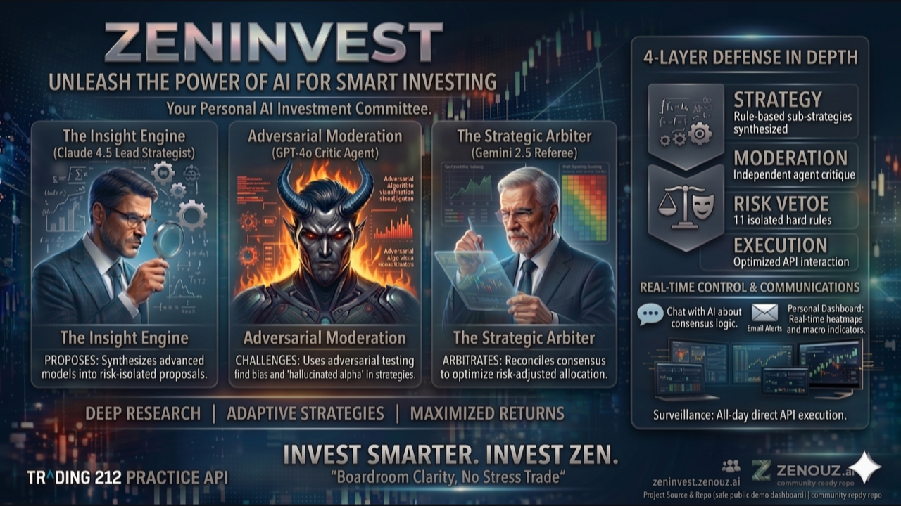
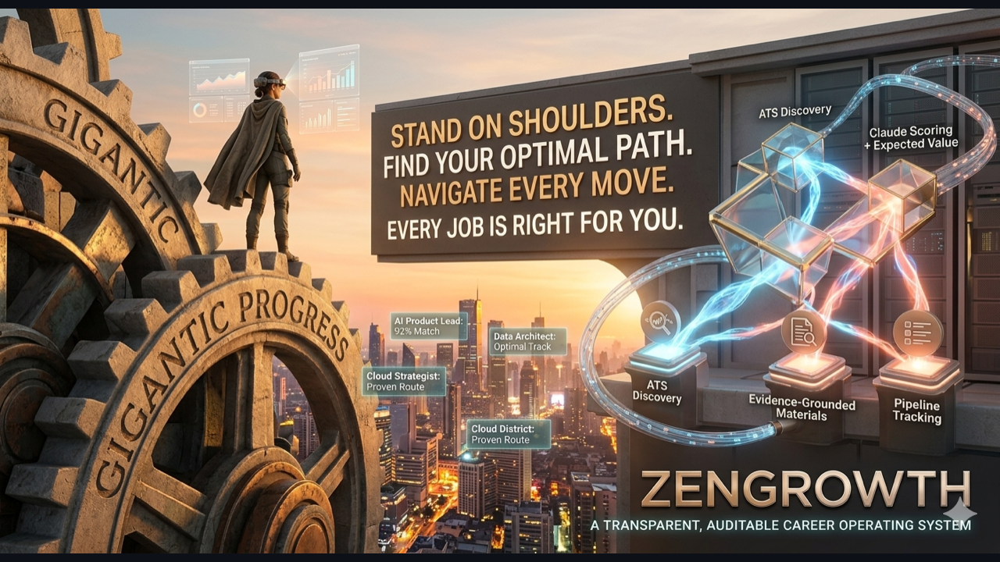
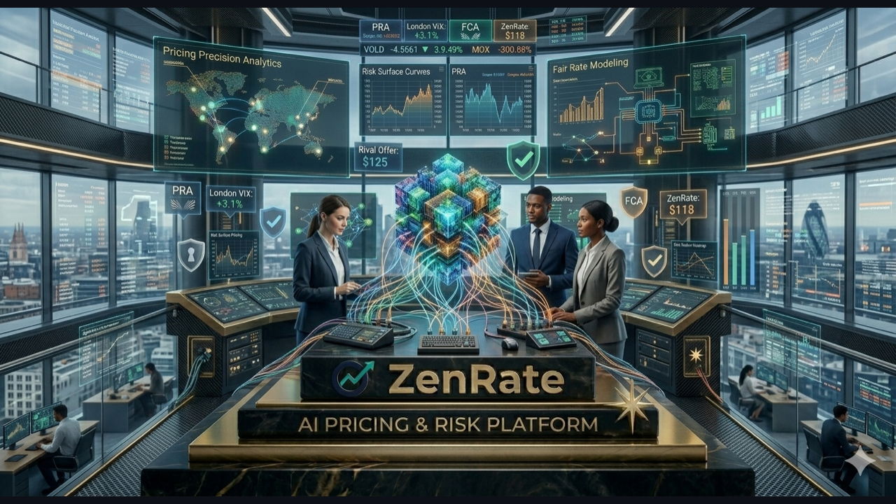
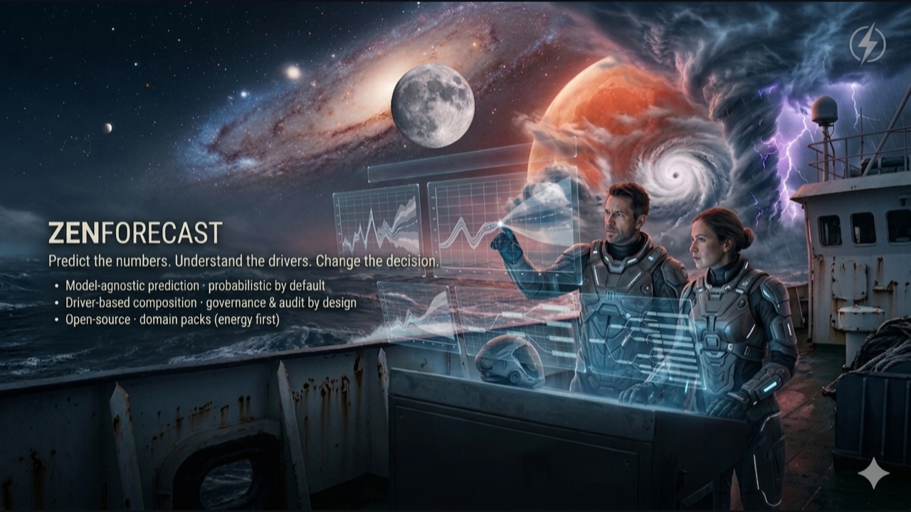
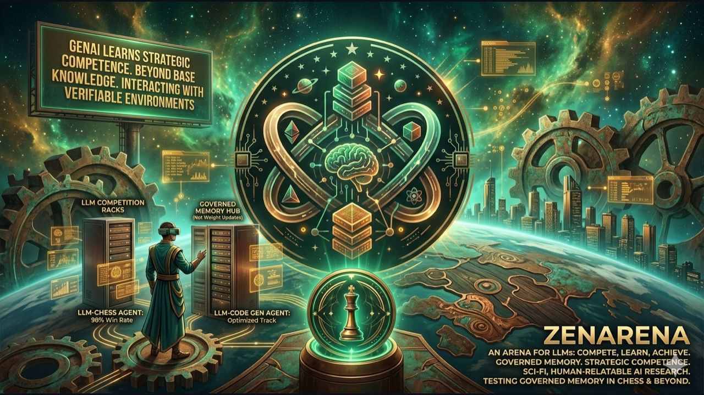
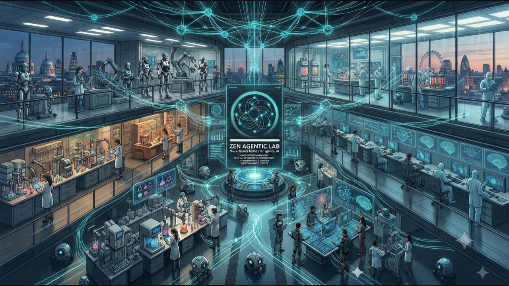
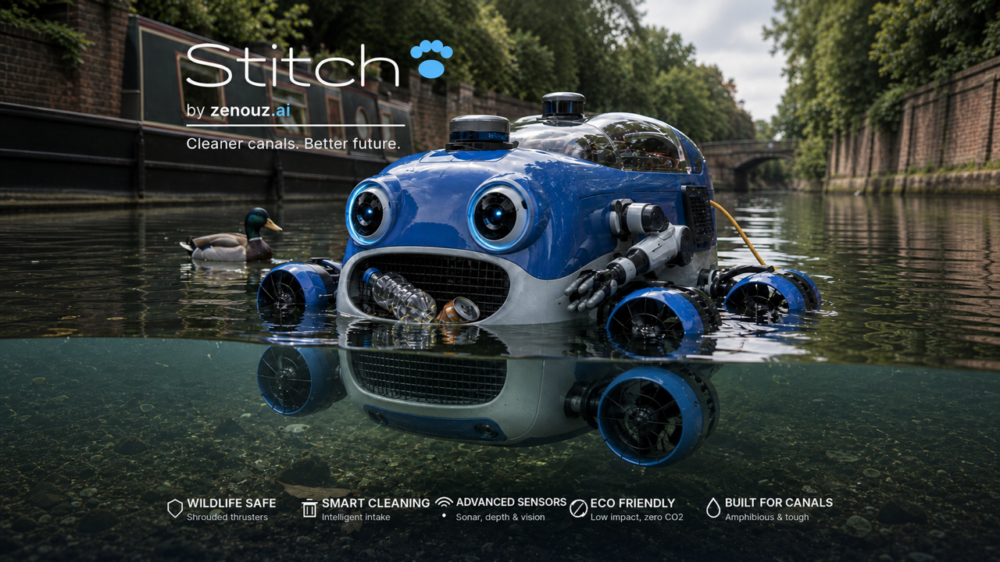

<h1 align="center">Kayvan Zenouz</h1>

  <strong>AI leader · PhD Mathematics · Enterprise AI strategy, governed agentic systems, and responsible transformation</strong> 
  Research, consulting, delivery. Governed AI for consequential decisions.

  
  
  

> **Independent work.** The projects below are personal, non-commercial research
> and development. They are separate from my professional employment and are
> shared for research and demonstration.

## Focus

I lead AI strategy, teams, and delivery in regulated industries, and I build
agentic systems where specialist agents research, reason, and explain while
deterministic software retains consequential decisions, safety rules,
evaluation, and auditability.

- Sectors: finance, insurance, energy and utilities, and higher education
- Leadership: enterprise AI strategy, responsible transformation, and AI governance, from FTSE-100 financial services to Big Four consulting
- Research: PhD in Mathematics (Exeter), peer-reviewed pure mathematics, and pre-registered AI studies
- Building: open-source systems and research builds that turn new ideas into tested practice

## Selected impact

- Built and led a 10-person AI and data science function in FTSE-100 financial services, managing a £1M+ budget and delivering £2M+ realised commercial value
- Leads agentic AI strategy and delivery in Big Four consulting across energy, utilities, and other regulated sectors
- Forum Innovation Award 2026, Dataiku Summit 2025 speaker, and AI advisor to retail executive leadership
- Former university lecturer in mathematics, statistics, and machine learning, teaching 400+ students per term
- Maintains two open-source systems, two working papers, and a set of documented research builds

## Open-source systems

### [ZenInvest](https://github.com/zenouz-ai/zeninvest)

An open, audited experiment in where LLMs add value to investment decisions.
A multi-LLM committee traded a paper account for six months and showed no entry
edge; the evidence is published as a working paper. The redesign, ZEN-2, tests a
thesis-driven agent against index and rules-only arms under a decision rule
frozen in advance, while deterministic Python keeps the veto and audit trail.

**Pattern:** published negative results · control arms · deterministic risk controls 
**Explore:** [repository](https://github.com/zenouz-ai/zeninvest) · [project brief](https://zenouz.ai/projects/zeninvest/) · [working paper](https://github.com/zenouz-ai/zeninvest/blob/main/docs/HONEST_AI_VALUE_REVIEW.md)

### [ZenGrowth](https://github.com/zenouz-ai/zengrowth)

A local-first career operating system for role discovery, evidence-grounded
applications, interviews, offers, and later career transitions. Grounding gates
block unsupported claims, while audit trails and human approval keep external
actions under operator control.

**Pattern:** verified evidence · explainable ranking · human-controlled workflow 
**Explore:** [repository](https://github.com/zenouz-ai/zengrowth) · [project brief](https://zenouz.ai/projects/zengrowth/) · [working paper](https://github.com/zenouz-ai/zengrowth/blob/main/output/pdf/zengrowth-grounded-not-automated-v0.4.pdf)

## Research and publications

- **Pure mathematics:** [Skew braces and Hopf-Galois structures of Heisenberg type](https://doi.org/10.1016/j.jalgebra.2019.01.012), *Journal of Algebra* 524 (2019); PhD thesis [On Hopf-Galois structures and skew braces of order p³](https://ore.exeter.ac.uk/repository/handle/10871/32248), University of Exeter (2018)
- **Working papers:** [Where LLMs actually add value](https://github.com/zenouz-ai/zeninvest/blob/main/docs/HONEST_AI_VALUE_REVIEW.md) (ZenInvest) and [Grounded, not automated](https://github.com/zenouz-ai/zengrowth/blob/main/output/pdf/zengrowth-grounded-not-automated-v0.4.pdf) (ZenGrowth)
- **Pre-registered study:** [a solver-free graph-theoretic mask for grid-control RL](https://zenouz.ai/writing/matroid-grid-rl-negative-result/), reported as a negative result
- **Everything in one place:** [zenouz.ai/research](https://zenouz.ai/research/)

## Research builds

Five focused builds test reusable ideas before they become product claims.

### [ZenRate](https://zenouz.ai/writing/zenrate-agentic-pricing/)

A plugin-based pricing and risk engine where deterministic actuarial models own
the maths and collaborating agents advise, explain, and audit. A compliance veto,
dual customer and profit scorecard, and bi-temporal record make each decision inspectable.

### [ZenForecast](https://zenouz.ai/writing/zenforecast-agentic-forecasting/)

A governance-first forecasting foundation with interchangeable models,
probabilistic outputs, leakage-resistant walk-forward evaluation, and an
append-only decision ledger.

### [ZenArena](https://zenouz.ai/writing/zenarena-governed-memory/)

A falsifiable research platform testing whether a frozen model can improve
through governed memory alone. Chess supplies the task; post-hoc verification,
provenance, validation, deduplication, and decay guard against unreliable lessons.

### [ZenLab](https://zenouz.ai/writing/zenlab-agentic-sandbox/)

An offline-first evidence lab where agentic techniques must earn their way into
production through small, reproducible experiments, deterministic safety floors,
and explicit promotion gates.

### [Stitch](https://zenouz.ai/writing/stitch-digital-twin/)

A ROS 2 and Gazebo digital twin for a wildlife-safe canal-cleaning robot. Hardware
spend stays locked until the simulated system can hold station, detect litter,
complete its mission, and stop safely for wildlife.

## Core stack

  
  
  
  
  
  
  
  
  
  
  
  
  
  

---

<i>Mathematics keeps the reasoning honest. Teaching keeps it clear. Building keeps it real.</i>

